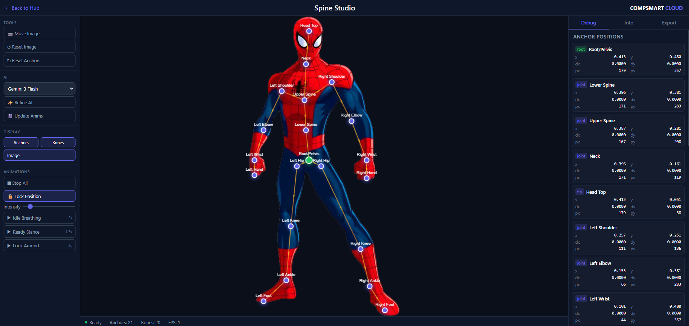

# AI Spine Animator

AI-powered 2D skeletal animation studio. Upload any image and Google Gemini Vision automatically detects anchor points, builds a bone hierarchy, and generates ready-to-play animations — all in the browser.

## Features

- **AI Skeletal Analysis** — Upload a 2D character, sprite, or any image. Gemini Vision detects anatomical anchor points (joints, tips, roots) and builds a bone hierarchy automatically.
- **AI Anchor Refinement** — Iterative multi-pass refinement sends an annotated image back to the AI to correct anchor placement with sub-pixel precision.
- **AI Animation Generation** — Context-appropriate animations (breathing, idle sway, blinking, waving) generated from the skeleton structure. Regenerate anytime after adjusting anchors.
- **Manual Anchor Editing** — Drag any anchor point to reposition it. The mesh deforms in real-time as you adjust.
- **Simultaneous Animation Playback** — Toggle multiple animations on/off independently. Transforms blend additively (rotations and translations sum, scales multiply).
- **Normalized Coordinate System** — All data stored in resolution-independent 0–1 coordinates. Animations look identical at any viewport size.
- **Model Selector** — Switch between Gemini 2.0 Flash, 2.5 Flash, 3 Flash Preview, and 3 Pro Preview from the UI.
- **Export** — Download a ZIP containing the original image, `skeleton.json` (anchors, bones, animations), and a usage README.
- **Save/Load Projects** — Persist projects to the server and reload them later.

## Architecture

```
┌─────────────┐     ┌──────────┐     ┌──────────────────────┐
│  Browser UI │────▶│  api.php │────▶│  Python + Gemini API │
│ (index.html)│◀────│  (REST)  │◀────│  (analyze/refine/    │
└─────────────┘     └──────────┘     │   update animations) │
                                     └──────────────────────┘
```

### Frontend (index.html)

Single-page app with all CSS and JavaScript inline. Key classes:

| Class | Responsibility |
|---|---|
| **Viewport** | Single source of truth for coordinate conversion. `toPixelX/Y()` converts normalized → pixels. `mouseToNorm()` converts mouse events → normalized coords. |
| **SpineProject** | Pure data container — anchors, bones, animations — all in normalized 0–1 space. |
| **NormalizedMesh** | Triangle mesh generation and deformation entirely in 0–1 space. No image dimensions needed. |
| **Renderer** | Draws the deformed image, bone lines, and anchor dots on a single `<canvas>`. Converts to pixels only at draw time via Viewport. |
| **InputHandler** | Mouse/touch input → normalized coordinates. Handles anchor dragging and image panning. |
| **AnimationEngine** | Keyframe interpolation with support for multiple simultaneous animations via additive blending. |
| **DebugPanel** | Real-time anchor position readout. |
| **SpineApp** | Orchestrator wiring everything together. |

**Rendering pipeline:**

```
AI data (normalized 0-1) → SpineProject → NormalizedMesh.deform()
    → Renderer converts to pixels ONLY at draw time via Viewport.toPixelX/Y()
```

### Backend (api.php)

PHP REST API that proxies requests to Python scripts:

| Endpoint | Method | Description |
|---|---|---|
| `?action=upload` | POST | Upload an image (multipart form, max 10 MB) |
| `?action=analyze` | POST | Run full AI skeletal analysis on an uploaded image |
| `?action=refine` | POST | Refine anchor positions using AI vision feedback |
| `?action=update_animations` | POST | Regenerate animations for current anchor/bone layout |
| `?action=save` | POST | Save project JSON to server |
| `?action=projects` | GET | List saved projects |
| `?action=load` | GET | Load a saved project |

### Python Scripts (bin/)

| Script | Purpose |
|---|---|
| `spine_analyze.py` | Full image analysis — detects anchors, bones, and generates initial animations |
| `spine_refine.py` | Sends annotated image (with drawn anchor markers) back to AI for position correction |
| `spine_update_anims.py` | Regenerates animations using current anchor/bone positions |

All scripts accept a `--model` flag to select the Gemini model at runtime.

## Requirements

- **PHP 7.4+** with `shell_exec` enabled
- **Python 3.8+**
- **Python packages:**
  ```
  google-genai
  Pillow
  ```
- **Google Gemini API key** — stored in one of:
  - `/var/www/evo/vault/gemini_key.txt`
  - Environment variable `GOOGLE_API_KEY` or `GEMINI_API_KEY`
- **Web server** (Apache/Nginx) serving the `spine-studio/` directory with PHP support

## Installation

1. **Clone the repository:**
   ```bash
   git clone https://github.com/compsmart/ai-spine-animator.git
   cd ai-spine-animator
   ```

2. **Install Python dependencies:**
   ```bash
   pip install google-genai Pillow
   ```

3. **Set up your Gemini API key:**
   ```bash
   # Option A: file
   echo "your-api-key-here" > /var/www/evo/vault/gemini_key.txt

   # Option B: environment variable
   export GOOGLE_API_KEY="your-api-key-here"
   ```

4. **Configure your web server** to serve the app directory with PHP enabled. Example for Apache:
   ```apache
   <VirtualHost *:80>
       DocumentRoot /path/to/ai-spine-animator/app
       <Directory /path/to/ai-spine-animator/app>
           AllowOverride All
           Require all granted
       </Directory>
   </VirtualHost>
   ```

5. **Ensure directories are writable** by the web server:
   ```bash
   mkdir -p app/uploads app/projects
   chown -R www-data:www-data app/uploads app/projects
   ```

6. **Update script paths** in `app/api.php` if your `bin/` directory is in a different location.

## User Guide

### Getting Started

1. **Open the app** in your browser.
2. **Upload an image** — drag and drop onto the canvas area, or click to browse. Supports PNG, JPG, GIF, WebP, and SVG.
3. **Wait for AI analysis** — the status bar shows progress. The AI will:
   - Detect anchor points (joints, roots, tips)
   - Build a bone hierarchy
   - Generate 3–5 context-appropriate animations
   - Run 2 refinement passes to improve anchor placement

### Left Panel — Tools

The left panel is organized into groups:

#### Tools
- **Move Image** — Click and drag to pan the image on the canvas.
- **Reset Image** — Reset the image back to its default centered position.
- **Reset Anchors** — Reset all anchors to their AI-detected positions (undoes manual drags).

#### AI
- **Model Selector** — Choose which Gemini model to use for AI operations. Options:
  - Gemini 2.0 Flash (fastest, lowest quality)
  - Gemini 2.5 Flash
  - Gemini 3 Flash Preview
  - Gemini 3 Pro Preview (best quality, default)
- **Refine AI** — Send the current anchor layout back to AI for position correction.
- **Update Anims** — Regenerate all animations based on the current anchor and bone positions. Useful after manually adjusting anchors.

#### Display
- **Anchors** — Toggle anchor dot visibility.
- **Bones** — Toggle bone line visibility.
- **Image** — Toggle the source image (shows just the skeleton when off).

#### Animations
- **Stop All** — Stop all playing animations and reset transforms.
- **Lock Position** — When enabled (default), animations only rotate and scale — they don't translate anchor positions. Disable to allow full movement.
- **Intensity** — Slider controlling animation strength (0–100%). Lower values produce subtler motion.
- **Animation Buttons** — Each detected animation appears as a toggle button. Click to start/stop. Multiple animations can play simultaneously — their transforms blend additively.

### Editing Anchors

- **Drag anchors** directly on the canvas to reposition them. The mesh deforms in real-time.
- After repositioning, click **Refine AI** to let the AI fine-tune placement, or **Update Anims** to generate new animations that match the new skeleton layout.

### Right Panel — Info & Export

Three tabs:

- **Debug** — Live readout of all anchor positions (normalized coordinates, pixel coordinates, and current dx/dy offsets).
- **Info** — Project metadata: image type, dimensions, anchor/bone/animation counts, filename, AI description.
- **Export** — Download assets:
  - **Download ZIP** — Contains the original image, `skeleton.json`, and a README.
  - **Save to Cloud** — Saves the project to the server for later loading.

### Loading a Saved Project

1. On the upload screen, click **Load Existing Project**.
2. Select a project from the list.
3. The image, anchors, bones, and animations are all restored.

## Data Format

All coordinates use a **normalized 0–1 system** where `(0, 0)` is the top-left corner and `(1, 1)` is the bottom-right corner of the image.

### skeleton.json

```json
{
  "anchors": [
    {
      "id": "head",
      "label": "Head",
      "x": 0.5,
      "y": 0.15,
      "type": "joint"
    }
  ],
  "bones": [
    {
      "id": "neck",
      "from": "head",
      "to": "torso"
    }
  ],
  "animations": [
    {
      "name": "Breathing",
      "duration": 2.0,
      "loop": true,
      "keyframes": [
        {
          "time": 0.0,
          "anchors": {
            "torso": {
              "rotation": 0,
              "translateX": 0.0,
              "translateY": 0.0,
              "scale": 1.0
            }
          }
        },
        {
          "time": 0.5,
          "anchors": {
            "torso": {
              "rotation": 0,
              "translateX": 0.0,
              "translateY": -0.01,
              "scale": 1.02
            }
          }
        },
        {
          "time": 1.0,
          "anchors": {
            "torso": {
              "rotation": 0,
              "translateX": 0.0,
              "translateY": 0.0,
              "scale": 1.0
            }
          }
        }
      ]
    }
  ]
}
```

### Animation Transform Values

| Property | Range | Description |
|---|---|---|
| `rotation` | -45 to 45 | Degrees of rotation around the anchor point |
| `translateX` | -0.05 to 0.05 | Horizontal offset as fraction of image width |
| `translateY` | -0.05 to 0.05 | Vertical offset as fraction of image height |
| `scale` | 0.8 to 1.2 | Scale factor (1.0 = no change) |

## Project Structure

```
ai-spine-animator/
├── app/
│   ├── index.html          # Frontend (HTML + CSS + JS, single file)
│   ├── api.php             # Backend REST API
│   ├── .user.ini           # PHP config
│   ├── uploads/            # Uploaded images (created automatically)
│   └── projects/           # Saved project JSON files (created automatically)
├── bin/
│   ├── spine_analyze.py    # AI image analysis
│   ├── spine_refine.py     # AI anchor refinement
│   └── spine_update_anims.py # AI animation regeneration
└── README.md
```

## License

MIT
